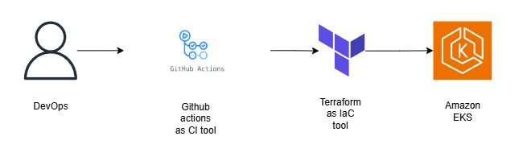

# terraform-eks-module

## Overview
This Terraform module is designed to simplify the deployment and management of AWS Elastic Kubernetes Service (EKS) clusters. It abstracts away much of the complexity of provisioning EKS clusters with configurable parameters for scalability, security, and reliability.



## Features
- **EKS Cluster Creation**: Automatically deploys an EKS cluster.
- **Node Group Setup**: Configures the EC2 instances to be used in the EKS cluster.
- **VPC Integration**: Integrates seamlessly with VPCs for networking.
- **IAM Role Management**: Manages IAM roles for EKS worker nodes and service accounts.

## Requirements
- Terraform 0.12 or later
- AWS account with the necessary permissions
- IAM roles and policies for EKS

## Usage

1. Clone the repository:
   ```bash
   git clone https://github.com/sumandhakal04/terraform-eks-module.git
   cd terraform-eks-module
   ```

2. Initialize Terraform:
   ```bash
   terraform init
   ```

3. Create the Terraform plan:
   ```bash
   terraform plan
   ```

4. Apply the plan to provision the resources:
   ```bash
   terraform apply
   ```

## Inputs
| Name               | Description                                    | Type   | Default  | Required |
|--------------------|------------------------------------------------|--------|----------|----------|
| `cluster_name`      | The name of the EKS cluster                    | string | n/a      | yes      |
| `node_group_count`  | The number of nodes in the worker group        | number | `3`      | no       |

## Outputs
| Name            | Description                            |
|-----------------|----------------------------------------|
| `cluster_id`    | The ID of the created EKS cluster      |
| `node_group_id` | The ID of the created node group       |


## Resources
- [AWS EKS Documentation](https://docs.aws.amazon.com/eks/latest/userguide/)
